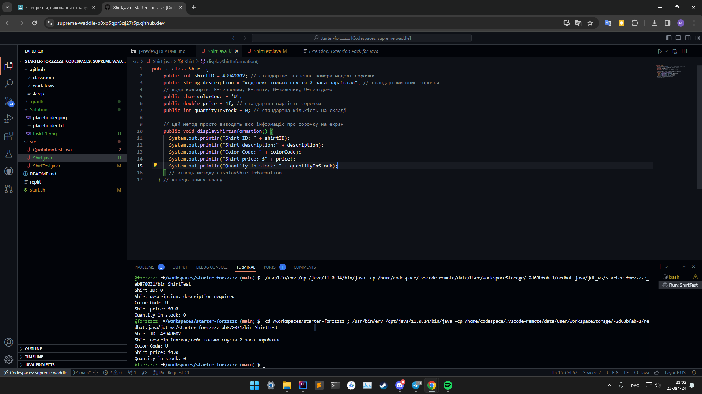

# Завдання 1.1

## Код

``` java
public class Shirt {
    public int shirtID = 0; // стандартне значення номера моделі сорочки
    public String description = "-description required-"; // стандартний опис сорочки
    // коди кольорів: R=червоний, B=синій, G=зелений, U=невідомо
    public char colorCode = 'U';
    public double price = 0.0; // стандартна вартість сорочки
    public int quantityInStock = 0; // стандартна кількість на складі
    
    // цей метод просто виводить всю інформацію про сорочку на екран
    public void displayShirtInformation() {
      System.out.println("Shirt ID: " + shirtID);
      System.out.println("Shirt description:" + description);
      System.out.println("Color Code: " + colorCode);
      System.out.println("Shirt price: $" + price);
      System.out.println("Quantity in stock: " + quantityInStock);
    } // кінець методу displayShirtInformation
} // кінець опису класу
  ```

## Скриншот


# Завдання 1.2

## Код

``` java
  public class Shirt {
    public int shirtID = 43949002; // стандартне значення номера моделі сорочки
    public String description = "кодспейс только спустя 2 часа заработал"; // стандартний опис сорочки
    // коди кольорів: R=червоний, B=синій, G=зелений, U=невідомо
    public char colorCode = 'U';
    public double price = 4f; // стандартна вартість сорочки
    public int quantityInStock = 0; // стандартна кількість на складі
    
    // цей метод просто виводить всю інформацію про сорочку на екран
    public void displayShirtInformation() {
      System.out.println("Shirt ID: " + shirtID);
      System.out.println("Shirt description:" + description);
      System.out.println("Color Code: " + colorCode);
      System.out.println("Shirt price: $" + price);
      System.out.println("Quantity in stock: " + quantityInStock);
    } // кінець методу displayShirtInformation
  } // кінець опису класу
  ```

## Скриншот



# На 5 балів

## Код

``` java
public class Shirt {
    private int shirtID = 43949002; // стандартне значення номера моделі сорочки
    private String description = "кодспейс только спустя 2 часа заработал"; // стандартний опис сорочки
    // коди кольорів: R=червоний, B=синій, G=зелений, U=невідомо
    private char colorCode = 'G';
    private String color;
    private double price = 4f; // стандартна вартість сорочки
    private int quantityInStock = 0; // стандартна кількість на складі
    
    // цей метод просто виводить всю інформацію про сорочку на екран
    public void displayShirtInformation() {
      System.out.println("Shirt ID: " + shirtID);
      System.out.println("Shirt description:" + description);

      switch(colorCode) {
        case 'R':
          color = "red";
          break;
        case 'B':
          color = "blue";
          break;
        case 'G':
          color = "green";
          break;
        case 'U':
          color = "unset";
          break;
        default:
          color = "unset";
      }

      System.out.println("Color: " + color);
      System.out.println("Shirt price: $" + price);
      System.out.println("Quantity in stock: " + quantityInStock);


    } // кінець методу displayShirtInformation
  } // кінець опису класу
```

## Скриншот

