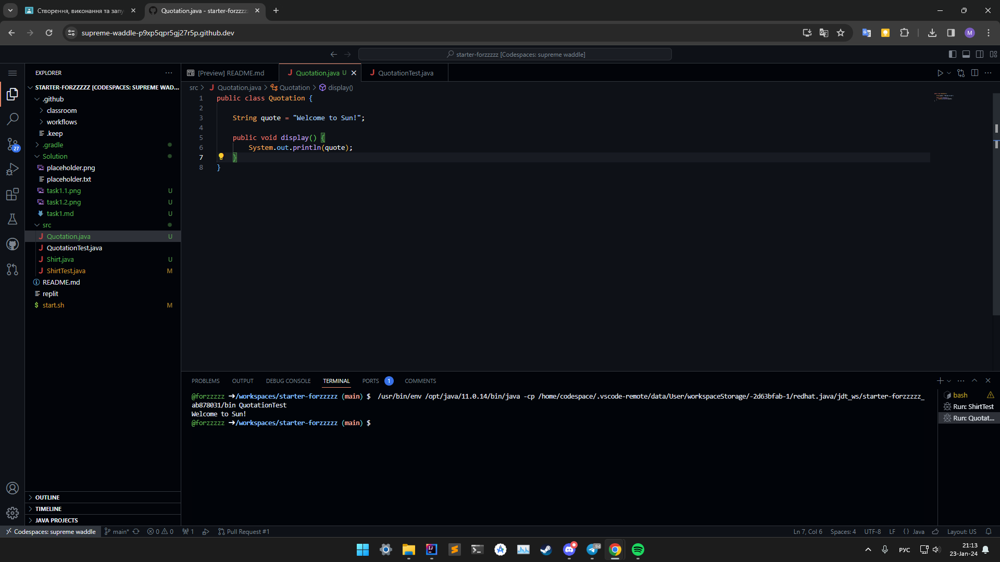
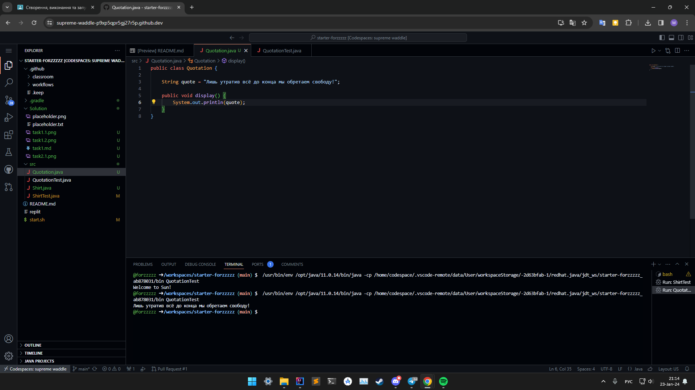
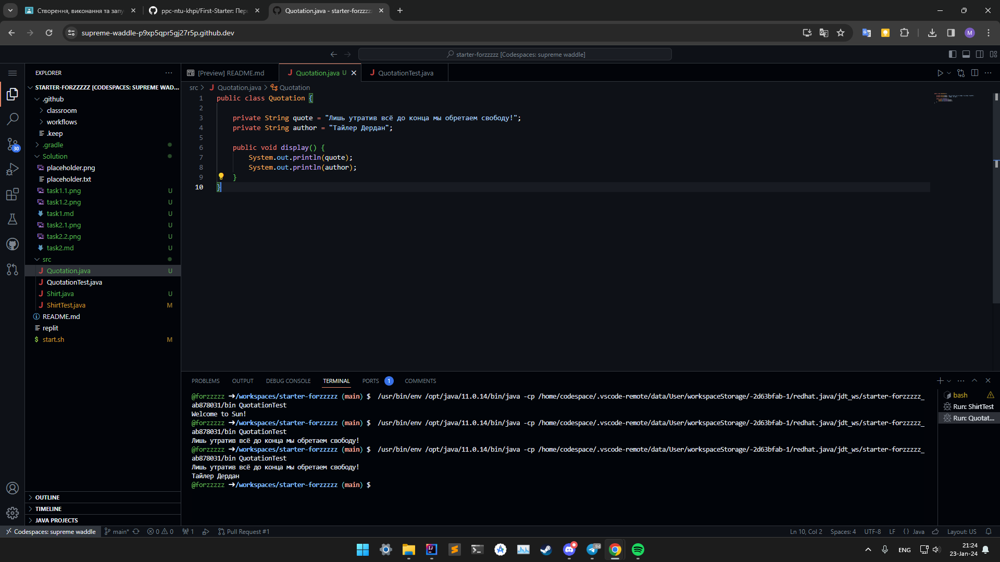

# Завдання 2.1

## Код

``` java
public class Quotation {

    String quote = "Welcome to Sun!";

    public void display() {
        System.out.println(quote);
    }
}
```

## Скриншот



# Завдання 2.2

## Код

``` java
public class Quotation {

    String quote = "Лишь утратив всё до конца мы обретаем свободу!";

    public void display() {
        System.out.println(quote);
    }
}
```

## Скриншот



# На 5 балів

## Код

``` java
public class Quotation {

    private String quote = "Лишь утратив всё до конца мы обретаем свободу!";
    private String author = "Тайлер Дердан";

    public void display() {
        System.out.println(quote);
        System.out.println(author);
    }
}
```

## Скриншот

